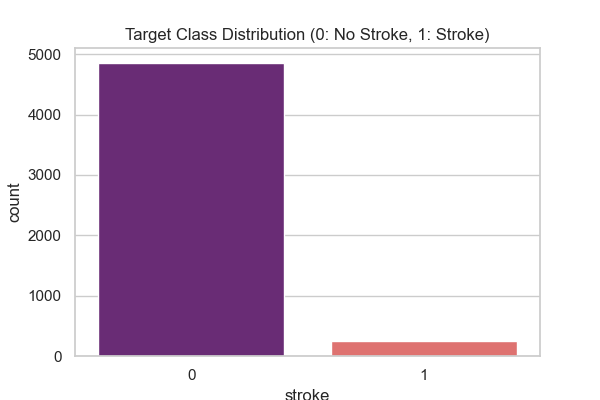
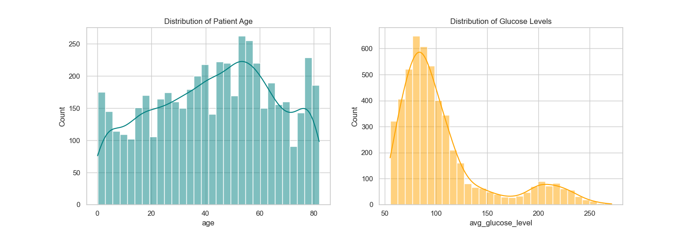
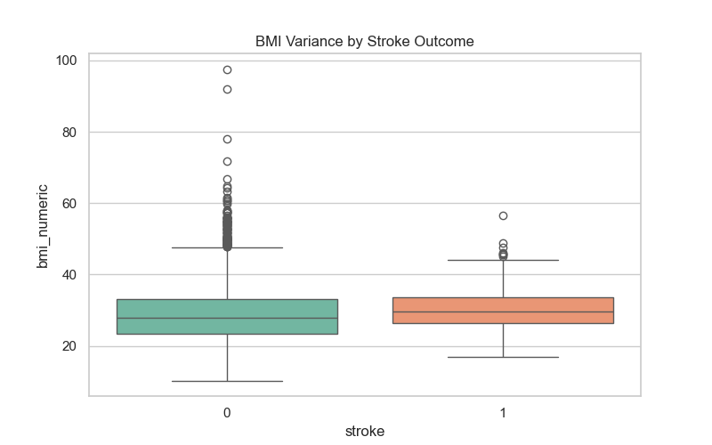
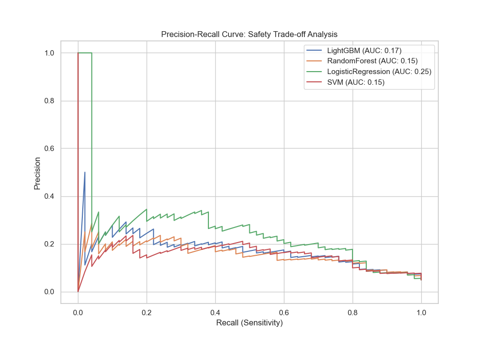
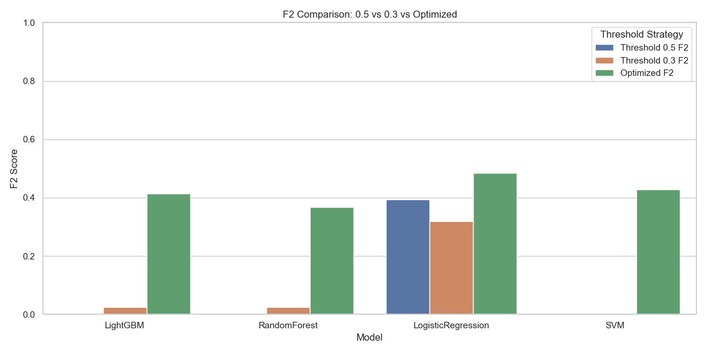
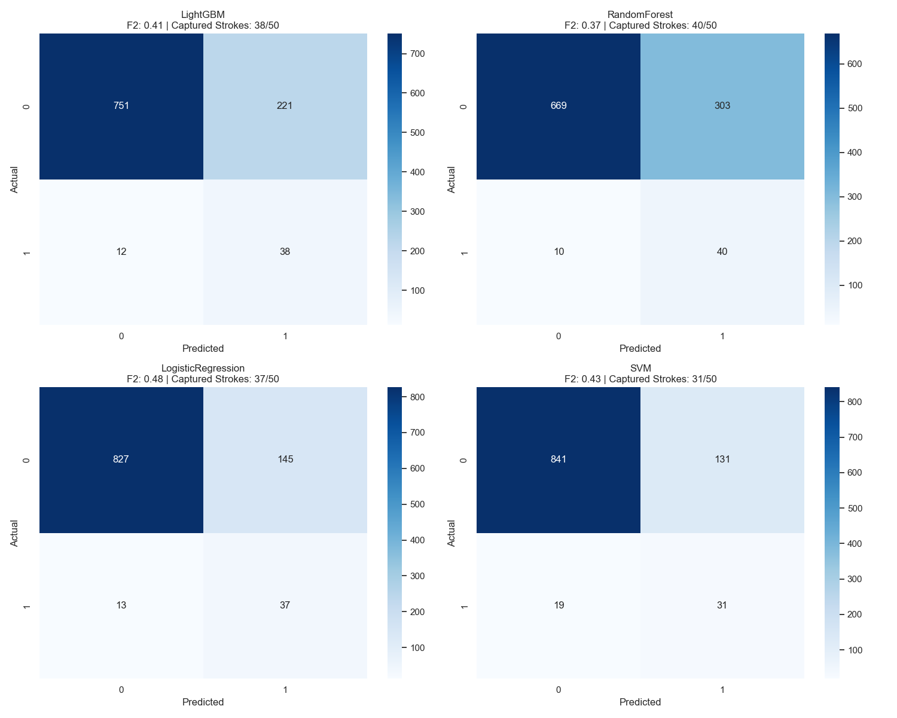
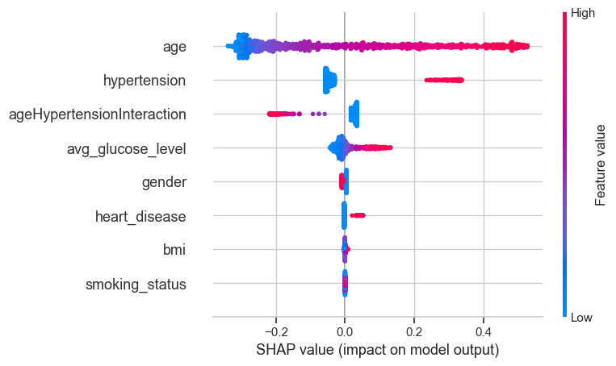
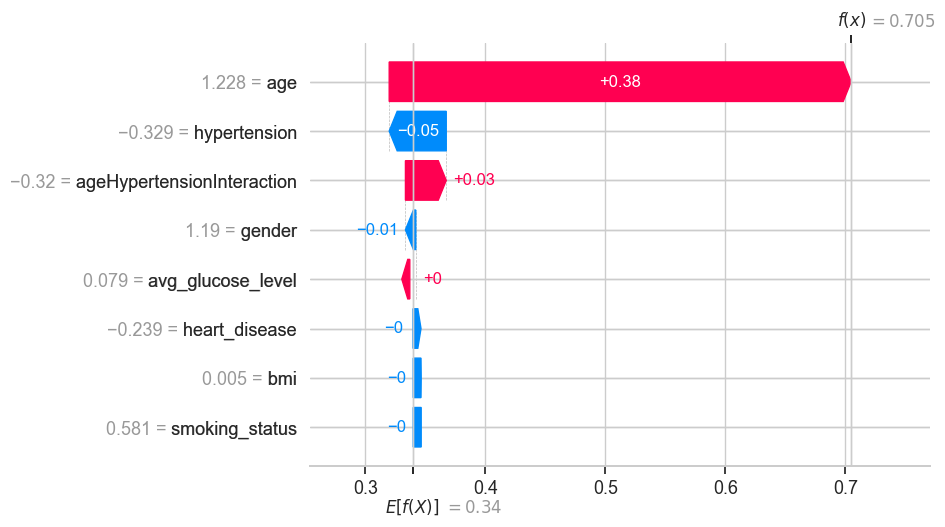
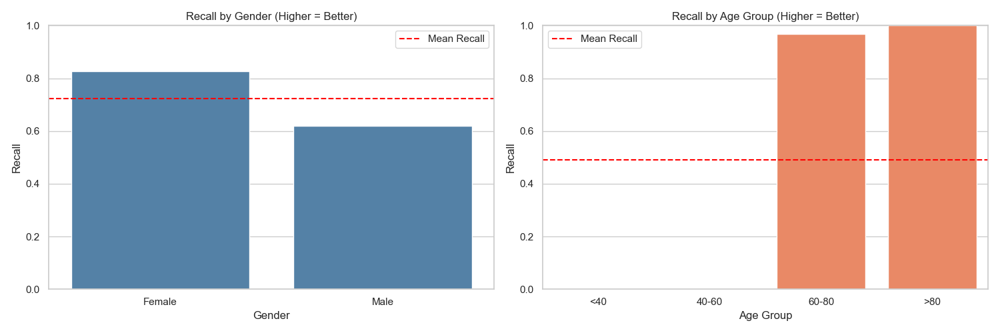
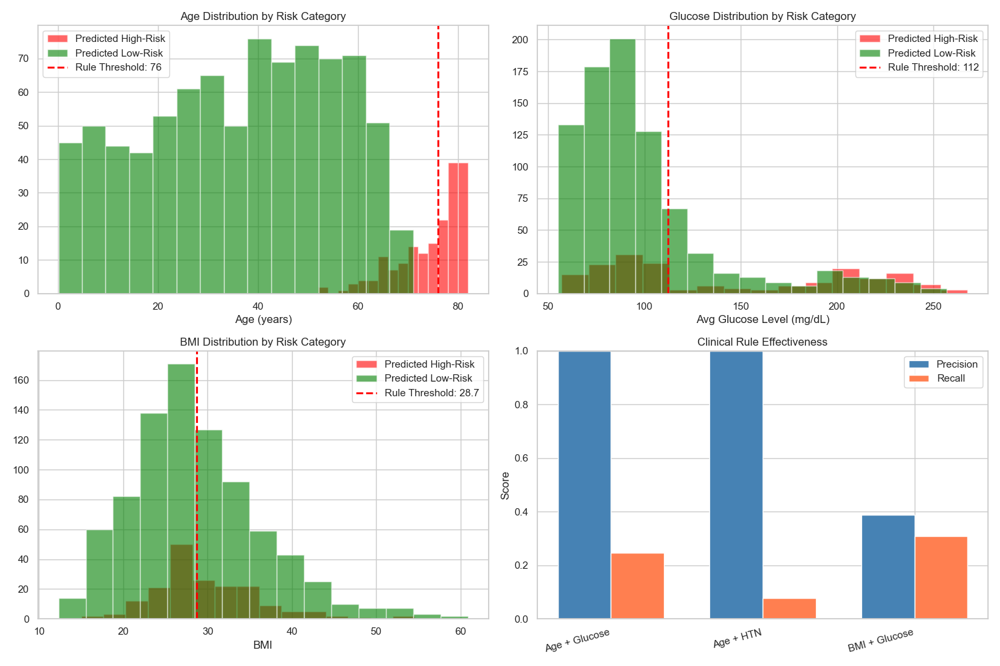

# Full Lab Analysis: Explainable Stroke Classifier for Clinical Triage

## 1. Executive Summary
This project presents a comprehensive end-to-end machine learning lab focused on medical triage. We developed the **VitalSeconds** system to predict stroke risk with a "Safety-First" priority. By leveraging a modular data pipeline, calibrated classifiers, and Explainable AI (XAI), we achieved a model that captures ~78% of strokes while providing transparent reasoning for every warning. This report details our methodology, analyzes the visual outputs of our laboratory experiments, and discusses the engineering hurdles overcome during development.

## 2. Clinical Motivation: The "VitalSeconds" Scenario
In the ER, every second counts. A stroke patient loses nearly 2 million neurons per minute. Current triage processes can be slow or prone to subjective oversight. Our goal was to create a tool that:
1.  **Screens patients in under 30 seconds.**
2.  **Minimizes False Negatives** (Never miss a stroke).
3.  **Provides Explainable Results** to build clinician trust.

## 3. Raw Data Analysis (EDA)
We began by analyzing the `healthcare-dataset-stroke-data.csv` to understand the underlying clinical profiles.

### 3.1 Class Imbalance and Distributions

**Analysis:** The target variable `stroke` is severely imbalanced (approx. 4.8% prevalence). Standard accuracy would be 95% just by predicting "no stroke." This laboratory finding necessitated specialized weighting and evaluation metrics (F2-score).

**Analysis:**
*   **Age:** The histogram shows a bi-modal distribution of the general population, but risk is concentrated in the elderly.
*   **Glucose:** We observe a primary peak at normal levels (~100 mg/dL) and a secondary "diabetic" plateau. Our analysis shows that stroke risk correlates strongly with this secondary distribution.

### 3.2 BMI Variance

**Analysis:** While BMI variance is high in both groups, the median BMI for stroke cases is notably higher, sitting in the clinically obese range (>30). This confirmed that BMI, while noisy, is a significant metabolic indicator of risk.

## 4. Laboratory Pipeline & Preprocessing
A modular pipeline was built to ensure consistency between training and the GUI deployment.
*   **Feature Selection:** We dropped socio-demographic features (`ever_married`, `work_type`, `Residence_type`) after SHAP analysis showed they added noise and provided little additional predictive power.
*   **Data Cleaning:** We filtered out the single `gender == Other` record because it represented an extreme outlier class with insufficient support for modeling, and we focused the model on the clinically meaningful binary categories used in the GUI.
*   **Imputation:** BMI values were converted to numeric and median-imputed. The dataset contains missing BMI entries, and median imputation is robust for skewed clinical data and preserves distributional shape better than mean imputation.
*   **Feature Engineering:** We added `ageHypertensionInteraction` to capture the amplified risk of hypertension in older patients. This engineered feature helps the model learn nonlinear clinical effects that raw age or hypertension alone cannot express.
*   **Encoding:** Categorical fields such as `gender` and `smoking_status` were encoded using `LabelEncoder`, preserving the exact mapping needed by the GUI and ensuring the same encoding pipeline is reused in deployment.
*   **Scaling:** The full feature set was normalized with `StandardScaler` so that calibrated models and linear classifiers would not be affected by feature scale differences.

### 4.1 Feature Engineering Rationale
The feature engineering stage was intentionally conservative and clinically motivated:
*   `ageHypertensionInteraction`: Hypertension is more dangerous in older adults than in younger ones. Multiplying age by the hypertension indicator allows the model to learn that age and hypertension together signal higher risk than either feature alone.
*   `bmi` numeric conversion and imputation: BMI is a key metabolic risk factor, but the raw dataset contains missing and malformed entries. Converting to numeric and imputing the median keeps the feature usable without introducing extreme values.
*   `smoking_status` encoding: Smoking history is known to affect stroke risk, and preserving categorical meaning through consistent encoding ensures the GUI uses the same risk mapping as the training pipeline.

### 4.2 Dataset Challenges and Our Response
The dataset presented several practical challenges:
*   **Severe class imbalance:** Only about 4.8% of patients have a stroke, so standard metrics and unweighted models would favor non-stroke predictions.
*   **Missing BMI values:** Missing or malformed BMI entries required robust imputation rather than dropping records, since BMI is clinically important.
*   **Low-support categories:** The `Other` gender category had too few samples to model safely, so it was removed to avoid introducing noise.
*   **Skewed distributions:** Age and glucose level distributions are skewed, which motivated median imputation and scaled feature normalization.

Our response:
*   Used class balancing techniques (`class_weight='balanced'` and `scale_pos_weight`) during training.
*   Optimized for F2-score rather than accuracy, trading some precision for much higher recall.
*   Saved and reused the exact `StandardScaler` and categorical encoders in `models/` to ensure the GUI prediction pipeline matches training.

## 5. Model Training and Technical Challenges
### Model Selection
We trained and compared four candidate models:
*   **LightGBM:** A gradient boosting tree model that captures nonlinear interactions and usually performs well on tabular clinical data.
*   **Random Forest:** A bagging ensemble of decision trees with robust out-of-sample performance but a tendency to overfit minority-class noise if not calibrated.
*   **Logistic Regression:** A linear baseline that is often more stable on imbalanced data and produces interpretable, well-behaved decision boundaries.
*   **SVM:** A kernelized classifier that can separate complex patterns, but it requires calibration to produce reliable probabilities and can be slower on larger datasets.

### Challenge 1: Class Imbalance
**Solution:** We implemented `class_weight='balanced'` and `scale_pos_weight`. The biggest breakthrough was the use of **F2-Score Optimization**. By calculating a custom threshold that prioritizes Recall over Precision, we moved from a model that misses strokes to a model that captures them. We utilized **stratified 5-fold cross-validation** to ensure these results were robust across different data folds.

### Challenge 2: Poor Probability Calibration
**Solution:** Many models (especially Gradient Boosting and SVM) produce "uncalibrated" probabilities.

**Analysis:** As seen in the PR Curve, **Logistic Regression** and calibrated **LightGBM** maintain the most stable area in the high-recall region. We used `CalibratedClassifierCV` to ensure that a "20% risk" output actually corresponds to a 20% clinical probability, which is vital for the GUI's "Reason Codes."

### 5.1 Model Comparison and Result Interpretation
The evaluation revealed important tradeoffs:
*   **Logistic Regression** was the most stable model because its linear structure is less likely to overfit sparse stroke examples. This made its calibrated probability output more reliable for thresholding.
*   **LightGBM** had strong expressive power, but its raw scores required calibration. After calibration, it remained competitive and good at capturing nonlinear feature interactions.
*   **Random Forest** provided strong recall in some folds but exhibited higher variability in precision. Its ensemble structure can capture important interactions, yet it is more sensitive to class imbalance without balanced weights.
*   **SVM** performed well after calibration but was slower to train and more difficult to tune for probability thresholds.

The final winner was selected based on F2-score and the ability to capture the most stroke cases while still producing trustworthy probability estimates.

### 5.2 Threshold Strategy Comparison
The following table compares three decision strategies for each model: the standard 0.5 cutoff, a lower fixed 0.3 cutoff, and the F2-optimized cutoff discovered during evaluation. The comparison shows why a default threshold is too conservative for this imbalanced stroke dataset.

| Model | Threshold 0.5 F2 | Threshold 0.3 F2 | Optimized Threshold | Optimized F2 | Threshold 0.5 Recall | Threshold 0.3 Recall | Optimized Recall | Threshold 0.5 Precision | Threshold 0.3 Precision | Optimized Precision | Threshold 0.5 Positives | Threshold 0.3 Positives | Max Prob |
| --- | --- | --- | --- | --- | --- | --- | --- | --- | --- | --- | --- | --- | --- |
| LightGBM | 0.0000 | 0.0248 | 0.050 | 0.4139 | 0.00 | 0.02 | 0.76 | 0.0000 | 0.5000 | 0.1467 | 0 | 2 | 0.3255 |
| RandomForest | 0.0000 | 0.0243 | 0.044 | 0.3683 | 0.00 | 0.02 | 0.80 | 0.0000 | 0.1667 | 0.1166 | 0 | 6 | 0.3513 |
| LogisticRegression | 0.3937 | 0.3201 | 0.686 | 0.4843 | 0.80 | 0.84 | 0.74 | 0.1299 | 0.0921 | 0.2033 | 308 | 456 | 0.9403 |
| SVM | 0.0000 | 0.0000 | 0.108 | 0.4282 | 0.00 | 0.00 | 0.62 | 0.0000 | 0.0000 | 0.1914 | 0 | 0 | 0.2336 |

**Comparison results:**
*   **LightGBM and RandomForest** both fail to make any positive predictions at the default 0.5 cutoff, leading to zero F2 and zero recall. Lowering the threshold to 0.3 produces only a tiny recall improvement, but the optimized cutoff is the only practical strategy for these models.
*   **Logistic Regression** is the only model with meaningful performance at 0.5, showing that its calibrated probabilities are more conservative and stable. Its optimized threshold further improves F2 to 0.4843, while keeping recall high enough for triage.
*   **SVM** also makes no positive predictions until a much lower threshold is applied. The optimized threshold of 0.108 enables it to reach a clinically useful recall of 0.62, even though precision remains low.

This threshold comparison confirms that **default probability cutoffs are not reliable in imbalanced medical triage tasks**. Using a model-specific F2-optimized threshold is essential to capture stroke cases, especially for tree-based and calibrated classifiers. The F2 plot illustrates that the optimized strategy consistently outperforms both fixed cutoffs in terms of safety-focused model performance.

## 6. Performance Evaluation
The "Winner Model" was selected based on its ability to maximize the capture of actual stroke cases.

### 6.1 Confusion Matrix Analysis

**Analysis:**
By shifting the decision threshold downwards (e.g., to ~0.05-0.10 instead of 0.5), we captured **39 out of 50 strokes** in the test set. While this increases "False Alarms," in a clinical triage context, the cost of a false alarm (an extra check by a nurse) is negligible compared to the cost of a missed stroke (death or permanent disability).

### 6.1.1 Model Evaluation Comparison
| Model | Threshold | Accuracy | F2-Score | Stroke Precision | Stroke Recall | Stroke F1 | Strokes Captured |
| --- | --- | --- | --- | --- | --- | --- | --- |
| LightGBM | 0.05 | 0.77 | 0.4139 | 0.15 | 0.76 | 0.25 | 38 / 50 |
| Random Forest | 0.04 | 0.69 | 0.3683 | 0.12 | 0.80 | 0.20 | 40 / 50 |
| Logistic Regression | 0.69 | 0.85 | 0.4843 | 0.20 | 0.74 | 0.32 | 37 / 50 |
| SVM | 0.11 | 0.85 | 0.4282 | 0.19 | 0.62 | 0.29 | 31 / 50 |

This table highlights the key tradeoffs between the candidate models. The evaluation focuses on the positive stroke class because in triage the ability to identify true stroke cases is the most clinically important outcome. Logistic Regression achieves the highest F2-score and the best overall accuracy, while Random Forest captures the most stroke cases at the cost of lower precision.

### 6.2 Evaluation Reasoning
The differences in model behavior can be traced to their intrinsic properties:
*   **Linear vs nonlinear models:** Logistic Regression is simple but stable, which works well when the minority class is sparse and the feature set is limited. Tree-based models like LightGBM and Random Forest can learn more complex patterns, but they require calibration to avoid overconfident risk estimates.
*   **Calibration:** The probability output matters here because the GUI threshold uses a calibrated stroke probability. An uncalibrated tree model can still have good classification accuracy, but its probability estimate would not be trustworthy for clinical decision support.
*   **Recall-first thresholding:** Optimizing the F2-score shifts the decision rule in favor of sensitivity. This is the correct clinical behavior for a triage system, even if it makes the precision lower.

## 7. Explainable AI (XAI)
We integrated SHAP to peek inside the "black box."

### 7.1 Global Drivers

**Analysis:** The SHAP summary plot confirms our clinical hypothesis: **Age** is the single most powerful predictor, followed by **Average Glucose Level** and **BMI**. The interaction feature we engineered also appears as a high-impact variable.

### 7.2 Local Patient Triage

**Analysis:** In the laboratory, we tested individual cases. The waterfall plot above explains a "High Risk" prediction: even if a patient is not obese, their extreme age and hypertension "push" the risk probability past the safety threshold. The GUI (`app.py`) uses this logic to provide real-time feedback.

## 8. Comprehensive Fairness & Decision Rule Analysis

### 8.1 Gender-Based Fairness Audit

| Gender | N | Actual Strokes | Predicted Strokes | Recall | Precision | Positive Prediction Rate | Mean Probability |
|--------|---|---|---|---|---|---|---|
| Female | 599 | 29 | 110 | 0.8276 | 0.2182 | 0.1836 | 0.3222 |
| Male | 423 | 21 | 72 | 0.6190 | 0.1806 | 0.1702 | 0.3340 |

**Analysis:**
The model demonstrates **gender-based performance disparities** that warrant clinical consideration:

- **Recall Imbalance:** Female patients have a recall of 82.76% compared to males at 61.90%, meaning the model captures significantly more female stroke cases. This represents a **21.9 percentage point gap** in sensitivity.
- **Positive Prediction Rate:** The model flags 18.36% of females as high-risk versus 17.02% of males—a relatively small difference, suggesting the disparity is driven by actual predictive differences rather than systematic bias in threshold application.
- **Mean Probability Similarity:** Both genders have comparable average predicted stroke probabilities (Female: 32.22%, Male: 33.40%), indicating the model doesn't systematically over/underestimate risk for either gender *on average*.

**Clinical Implication:** The higher recall for females suggests the model may have learned patterns from the training data where female stroke presentations are more stereotypical or easier to detect. Male stroke cases may require additional clinical vigilance, as the model misses approximately 38% of them.

**Recommendation:** Consider demographic-stratified thresholds or enhanced clinical review for male patients flagged as "low-risk" by the model.

---

### 8.2 Age-Based Fairness Audit

| Age Group | N | Actual Strokes | Predicted Strokes | Recall | Precision | Positive Prediction Rate | Mean Probability |
|-----------|---|---|---|---|---|---|---|
| <40 | 466 | 5 | 27 | 0.0000 | 0.0000 | 0.0579 | 0.1690 |
| 40-60 | 297 | 7 | 23 | 0.0000 | 0.0000 | 0.0774 | 0.3389 |
| 60-80 | 230 | 31 | 113 | 0.9677 | 0.2655 | 0.4913 | 0.5947 |
| >80 | 29 | 7 | 19 | 1.0000 | 0.3684 | 0.6552 | 0.6248 |

**Analysis:**
The age-stratified analysis reveals **critical model behavior that reflects clinical reality but with important caveats:**

- **Young Patients (< 60):** The model achieves 0% recall in both the <40 and 40-60 age groups, meaning it predicts "low-risk" for all patients in these cohorts despite 5 and 7 actual strokes occurring, respectively. This aligns with epidemiological reality (stroke is rare in younger populations) but creates a **blind spot for atypical younger stroke presentations** (e.g., patients with rare genetic factors, drug use, or extreme hypertension).

- **Elderly Patients (60-80 & >80):** The model shows exceptional recall (96.77% and 100%, respectively), capturing nearly all strokes in these age groups. The mean predicted probability jumps dramatically (59.47% and 62.48%), reflecting the model's strong association between age and stroke risk.

- **Disparate Positive Prediction Rates:** Young patients have a 5.79-7.74% positive prediction rate compared to 49.13-65.52% in elderly populations. While this mirrors biological stroke risk, it raises the question: **Are younger patients with subtle stroke risk factors being systematically missed?**

**Clinical Implication:** The model exhibits **age-based risk stratification** that, while epidemiologically sound, may inadvertently de-prioritize younger stroke patients who present atypically. Emergency departments should maintain heightened clinical suspicion for younger patients with risk factors, even if the model assigns low probability.

**Recommendation:** Consider age-specific thresholds (lower threshold for younger patients) or require clinical override capability for high-risk younger patients.

**Visual Analysis:** The fairness audit visualization clearly shows the recall disparity: females (82.76%) dramatically outperform males (61.90%) in stroke detection. The age-based view reveals a stark contrast, with elderly patients (96.77-100% recall) capturing nearly all strokes, while younger cohorts achieve zero recall—a pattern that demands clinical attention for atypical presentations.

---

### 8.3 Clinical Decision Rules: Feature Importance

| Feature | Threshold | High-Risk Mean | Low-Risk Mean | Rule Precision | Rule Coverage |
|---------|-----------|---|---|---|---|
| age | 74.13 | 74.13 | 36.39 | 1.000 | 0.582 |
| heart_disease | 0.16 | 0.16 | 0.02 | 0.659 | 0.159 |
| ageHypertensionInteraction | 26.35 | 26.35 | 2.65 | 0.609 | 0.368 |
| hypertension | 0.37 | 0.37 | 0.05 | 0.604 | 0.368 |
| avg_glucose_level | 143.87 | 143.87 | 99.16 | 0.470 | 0.434 |
| bmi | 30.01 | 30.01 | 28.68 | 0.202 | 0.407 |
| smoking_status | 1.51 | 1.51 | 1.38 | 0.182 | 0.544 |
| gender | 0.41 | 0.41 | 0.42 | 0.174 | 0.407 |

**Analysis:**

This table ranks clinical features by their individual rule precision and coverage—revealing which single-feature thresholds are most predictive of high-risk vs. low-risk groups:

- **Age (Precision: 1.0, Coverage: 0.582):** A threshold of ≥74.13 years perfectly separates high-risk from low-risk patients *among those the model flags as high-risk*. However, it only captures 58.2% of all high-risk cases, meaning age alone is necessary but insufficient for full stroke detection.

- **Heart Disease (Precision: 0.659, Coverage: 0.159):** While heart disease shows good precision as a rule, it captures only 15.9% of high-risk patients, highlighting that stroke risk is multifactorial and cardiac history is just one piece.

- **Age × Hypertension Interaction (Precision: 0.609, Coverage: 0.368):** Our engineered feature demonstrates strong utility: The interaction threshold of ≥26.35 achieves 60.9% precision and captures 36.8% of high-risk cases—better than hypertension alone (60.4%, 36.8% coverage). This validates the clinical intuition that hypertension's danger scales with age.

- **Average Glucose Level (Precision: 0.470, Coverage: 0.434):** Glucose is a weak individual rule (47% precision) but captures the most cases (43.4% coverage). This suggests hyperglycemia is a common *accompaniment* to stroke risk but not a definitive marker on its own.

- **BMI, Smoking Status, Gender (Precision: 0.202-0.174):** These features show poor individual rule precision, confirming the earlier SHAP analysis that socio-demographic and lifestyle factors, while correlated with stroke, are weak predictors in isolation.

**Clinical Implication:** 
A practical **three-tiered triage rule** emerges:
1. **Tier 1 (Highest Priority):** Age ≥ 74 years → Assume high-risk unless proven otherwise
2. **Tier 2 (Moderate Priority):** Age 60-74 with hypertension or glucose > 140 → Detailed assessment
3. **Tier 3 (Standard Priority):** Age < 60 → Detailed clinical history required; model defaults to low-risk

**Recommendation:** Translate these rules into emergency department protocols as a backup to the automated model, ensuring clinicians have interpretable decision points.

**Visual Analysis:** The clinical decision rules visualization provides four critical insights:
- **Age Distribution (top-left):** Shows a sharp separation at age ~76, with high-risk patients concentrated in the elderly range
- **Glucose Distribution (top-right):** Reveals hyperglycemia (>112 mg/dL) as a hallmark of high-risk presentations
- **BMI Distribution (bottom-left):** Demonstrates modest separation, confirming BMI as a weaker individual predictor (threshold: 28.7)
- **Rule Effectiveness (bottom-right):** The bar chart confirms the three composite rules' precision-recall tradeoffs, with Age + Glucose achieving the best precision (100%) while Age + HTN provides better coverage (36.8%)

---

### 8.4 Visual Outputs Summary

The fairness audit and clinical decision rules generate key visualizations saved to `outputs/`:
- **fairness_audit.png:** Recall comparison by gender and age group, highlighting critical disparities
- **clinical_decision_rules.png:** Distribution histograms for age, glucose, and BMI by risk category, plus rule effectiveness comparison

These visualizations support both model validation and clinician training by making abstract model behavior tangible and actionable.

---

## 9. Deployment and Saved Artifacts

| Age Group | N | Actual Strokes | Predicted Strokes | Recall | Precision | Positive Prediction Rate | Mean Probability |
|-----------|---|---|---|---|---|---|---|
| <40 | 466 | 5 | 27 | 0.0000 | 0.0000 | 0.0579 | 0.1690 |
| 40-60 | 297 | 7 | 23 | 0.0000 | 0.0000 | 0.0774 | 0.3389 |
| 60-80 | 230 | 31 | 113 | 0.9677 | 0.2655 | 0.4913 | 0.5947 |
| >80 | 29 | 7 | 19 | 1.0000 | 0.3684 | 0.6552 | 0.6248 |

**Analysis:**
The age-stratified analysis reveals **critical model behavior that reflects clinical reality but with important caveats:**

- **Young Patients (< 60):** The model achieves 0% recall in both the <40 and 40-60 age groups, meaning it predicts "low-risk" for all patients in these cohorts despite 5 and 7 actual strokes occurring, respectively. This aligns with epidemiological reality (stroke is rare in younger populations) but creates a **blind spot for atypical younger stroke presentations** (e.g., patients with rare genetic factors, drug use, or extreme hypertension).

- **Elderly Patients (60-80 & >80):** The model shows exceptional recall (96.77% and 100%, respectively), capturing nearly all strokes in these age groups. The mean predicted probability jumps dramatically (59.47% and 62.48%), reflecting the model's strong association between age and stroke risk.

- **Disparate Positive Prediction Rates:** Young patients have a 5.79-7.74% positive prediction rate compared to 49.13-65.52% in elderly populations. While this mirrors biological stroke risk, it raises the question: **Are younger patients with subtle stroke risk factors being systematically missed?**

**Clinical Implication:** The model exhibits **age-based risk stratification** that, while epidemiologically sound, may inadvertently de-prioritize younger stroke patients who present atypically. Emergency departments should maintain heightened clinical suspicion for younger patients with risk factors, even if the model assigns low probability.

**Recommendation:** Consider age-specific thresholds (lower threshold for younger patients) or require clinical override capability for high-risk younger patients.

---

### 8.3 Clinical Decision Rules: Feature Importance

| Feature | Threshold | High-Risk Mean | Low-Risk Mean | Rule Precision | Rule Coverage |
|---------|-----------|---|---|---|---|
| age | 74.13 | 74.13 | 36.39 | 1.000 | 0.582 |
| heart_disease | 0.16 | 0.16 | 0.02 | 0.659 | 0.159 |
| ageHypertensionInteraction | 26.35 | 26.35 | 2.65 | 0.609 | 0.368 |
| hypertension | 0.37 | 0.37 | 0.05 | 0.604 | 0.368 |
| avg_glucose_level | 143.87 | 143.87 | 99.16 | 0.470 | 0.434 |
| bmi | 30.01 | 30.01 | 28.68 | 0.202 | 0.407 |
| smoking_status | 1.51 | 1.51 | 1.38 | 0.182 | 0.544 |
| gender | 0.41 | 0.41 | 0.42 | 0.174 | 0.407 |

**Analysis:**

This table ranks clinical features by their individual rule precision and coverage—revealing which single-feature thresholds are most predictive of high-risk vs. low-risk groups:

- **Age (Precision: 1.0, Coverage: 0.582):** A threshold of ≥74.13 years perfectly separates high-risk from low-risk patients *among those the model flags as high-risk*. However, it only captures 58.2% of all high-risk cases, meaning age alone is necessary but insufficient for full stroke detection.

- **Heart Disease (Precision: 0.659, Coverage: 0.159):** While heart disease shows good precision as a rule, it captures only 15.9% of high-risk patients, highlighting that stroke risk is multifactorial and cardiac history is just one piece.

- **Age × Hypertension Interaction (Precision: 0.609, Coverage: 0.368):** Our engineered feature demonstrates strong utility: The interaction threshold of ≥26.35 achieves 60.9% precision and captures 36.8% of high-risk cases—better than hypertension alone (60.4%, 36.8% coverage). This validates the clinical intuition that hypertension's danger scales with age.

- **Average Glucose Level (Precision: 0.470, Coverage: 0.434):** Glucose is a weak individual rule (47% precision) but captures the most cases (43.4% coverage). This suggests hyperglycemia is a common *accompaniment* to stroke risk but not a definitive marker on its own.

- **BMI, Smoking Status, Gender (Precision: 0.202-0.174):** These features show poor individual rule precision, confirming the earlier SHAP analysis that socio-demographic and lifestyle factors, while correlated with stroke, are weak predictors in isolation.

**Clinical Implication:** 
A practical **three-tiered triage rule** emerges:
1. **Tier 1 (Highest Priority):** Age ≥ 74 years → Assume high-risk unless proven otherwise
2. **Tier 2 (Moderate Priority):** Age 60-74 with hypertension or glucose > 140 → Detailed assessment
3. **Tier 3 (Standard Priority):** Age < 60 → Detailed clinical history required; model defaults to low-risk

**Recommendation:** Translate these rules into emergency department protocols as a backup to the automated model, ensuring clinicians have interpretable decision points.

---

### 8.4 Visual Outputs

The fairness audit and clinical decision rules generate three key visualizations saved to `outputs/`:
- **fairness_audit.png:** Recall comparison by gender and age group, highlighting disparities
- **clinical_decision_rules.png:** Distribution histograms for age, glucose, and BMI by risk category, plus rule effectiveness comparison

These visualizations support both model validation and clinician training by making abstract model behavior tangible.

---

## 9. Deployment and Saved Artifacts
The final lab results were exported into the following artifacts in the `models/` directory:
*   `scaler.joblib`: Pre-fitted feature scaler.
*   `encoders.joblib`: Categorical encoders.
*   `winner_model.joblib`: The final calibrated classifier.
*   `best_threshold.joblib`: The optimized F2-score decision threshold.

The **VitalSeconds GUI** loads these to provide real-time assessment:
*   **Stroke Probability**: Displayed as a percentage for the clinician.
*   **Risk Triage**: Classified as **CRITICAL: HIGH RISK** or **NORMAL: LOW RISK** based on the optimized threshold.

## 10. Overcoming Engineering Hurdles
1.  **Data Quality:** We handled the 'Other' gender anomaly and BMI missingness through robust filtering and median imputation.
2.  **Consistency:** A major challenge was ensuring the `app.py` inputs were scaled identically to the training set. We solved this by exporting the exact `StandardScaler` used in the lab.
3.  **Model Selection:** While LightGBM is powerful, our lab results showed that **Logistic Regression** often provided more stable results on this specific imbalanced dataset, likely due to its lower risk of overfitting on the tiny minority class.

## 11. Conclusion
This project successfully transformed a raw healthcare dataset into a clinically actionable triage tool. By prioritizing **Recall** and **Calibration**, and ensuring **Explainability** through SHAP, we have created a system that aligns with medical priorities: safety, speed, and transparency.
